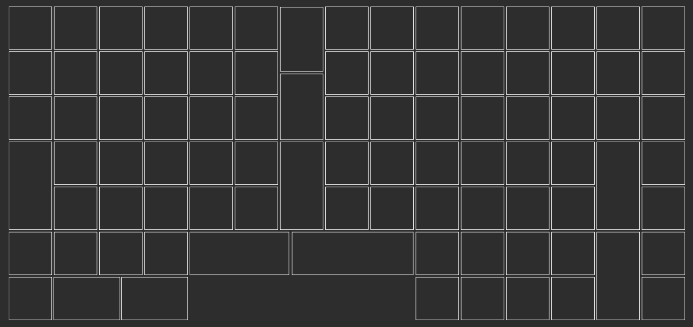

# Mecha Matrix 2030

This is a WIP keyboard project aimed around approximating the layout of the
TypeMatrix 2030 keyboard using off-the-shelf components and firmware.

The goal is that this keyboard pcb, switch plate, and case will be created in
ergogen and routing will be done with tooling centered around kicad automations.

## Some relevat url's around ergogen and other tooling:

[ergogen.cache.works](https://ergogen.cache.works/)\
Visualize the generated ergogen keyboard layout in real-time

[docs.ergogen.xyz](https://docs.ergogen.xyz/)

## GH projects centered around automating pcb design:

[soundmonster/samoklava](https://github.com/soundmonster/samoklava)\
Generated keyboard: The interesting thing about this keyboard is that it's a
declarative design:

- Layout is declared using Ergogen. New: no fork needed!
- The build system uses Ergogen to translate YAML to a KiCad PCB and plate files
  for FR-4 fab or laser cutting
- uses kicad-automation-scripts and FreeRouting to automatically route the
  traces on the PCB
- uses KiKit to render PCB previews (see top of this file) and production-ready
  Gerber files

[InteractiveHtmlBom](https://github.com/openscopeproject/InteractiveHtmlBom)\
Interactive HTML BOM generation plugin for KiCad, EasyEDA, Eagle, Fusion360 and
Allegro PCB designer

[KiKit](https://github.com/yaqwsx/KiKit)\
Automation tools for KiCAD

[Pinion](https://github.com/yaqwsx/Pinion)\
Generate interactive and nice-looking diagrams for your PCBs!

[KiBot](https://github.com/INTI-CMNB/KiBot)\
KiCad automation utility

[Ergogen (fork)](https://github.com/ImStuBTW/ergogen)\
Ergogen for with a few more footprints. Don't know if useful or not.

[kicad-kbdplacer](https://github.com/adamws/kicad-kbplacer)\
KiCad plugin for automatic keyboard's key placement and routing

## Kicad part libraries:

https://github.com/daprice/keyswitches.pretty

https://github.com/kiswitch/kiswitch

## Custom keycaps:

https://github.com/levpopov/LPX

https://github.com/wolfwood/printed-keycap-mods

https://github.com/braindefender/KLP-Lame-Keycaps

https://github.com/vvhg1/clp-keycaps

## Misc:

https://github.com/Zambumon/SKUF
